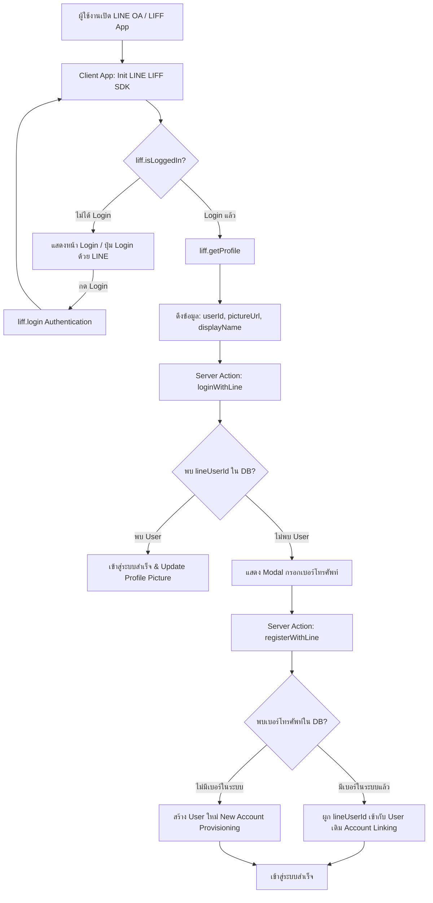
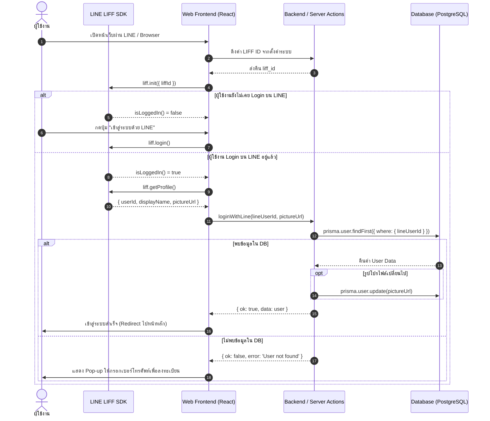
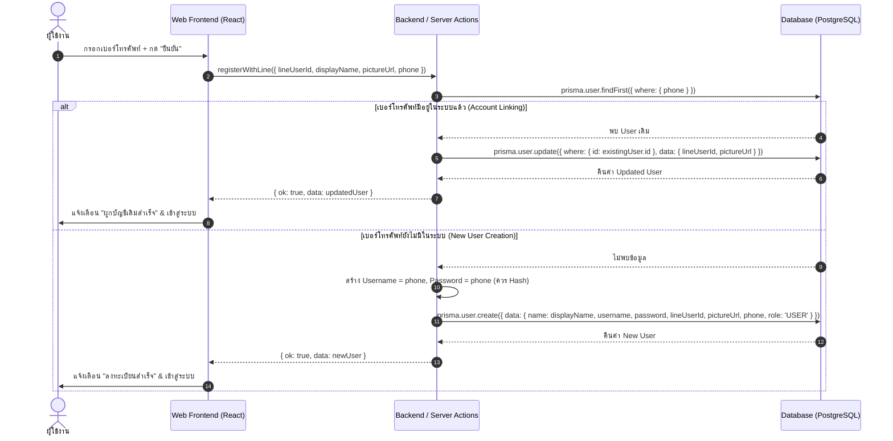

# เอกสารสถาปัตยกรรมและการออกแบบระบบ: LINE OA & LIFF Authentication / User Provisioning

เอกสารฉบับนี้จัดทำขึ้นเพื่อวิเคราะห์และสรุปรูปแบบการทำงานของการเข้าสู่ระบบ (Login) การสร้างบัญชีใหม่ (Registration) และการผูกบัญชี (Account Linking) ผ่าน **LINE Official Account (LINE OA)** และ **LINE LIFF (LINE Front-end Framework)** เพื่อให้สามารถนำพิมพ์เขียว (Blueprint) นี้ไปประยุกต์ใช้กับระบบอื่นๆ ได้อย่างมีประสิทธิภาพ

---

## 1. ภาพรวมสถาปัตยกรรม (System Architecture Overview)

ระบบใช้แนวคิด **Hybrid Authentication System** โดยรองรับทั้งการ Login แบบดั้งเดิม (Username/Password) และการ Login ผ่าน LINE LIFF โดยมีสถาปัตยกรรมการทำงานร่วมกันดังนี้:



---

## 2. โครงสร้างฐานข้อมูลที่ต้องการ (Database Schema Design)

ในการรองรับการเชื่อมต่อกับ LINE ระบบจำเป็นต้องมีฟิลด์สำหรับเก็บข้อมูลการยืนยันตัวตนจาก LINE ดังตัวอย่างโครงสร้าง (Prisma Schema):

```prisma
model User {
  id            String   @id @default(uuid())
  username      String   @unique
  password      String   // แนะนำให้ Hash ด้วย bcrypt ก่อนบันทึก
  role          Role     @default(SELLER)
  name          String
  nickname      String?
  phone         String?  @unique

  // 🔹 ส่วนที่ต้องเพิ่มสำหรับ LINE Integration
  lineUserId    String?  @unique // LINE User ID (e.g. U1234567890abcdef...)
  pictureUrl    String?  // รูปโปรไฟล์จาก LINE Account

  createdAt     DateTime @default(now())
  updatedAt     DateTime @updatedAt
}

enum Role {
  ADMIN
  SUPERSELLER
  SELLER
  STORE
  DRIVER
  USER
}
```

> **ข้อระวังใน DB Schema:**
> - `lineUserId`: ควรตั้งให้เป็น `@unique` และสามารถเป็น `null` ได้ (เนื่องจากบาง User อาจสมัครง่ายๆ ด้วยระบบปกติ)
> - `phone`: ควรกำหนดให้เป็น `@unique` หรือมี Index เพื่อความเร็วในการค้นหาขณะทำการ Account Linking

---

## 3. ลำดับขั้นตอนการทำงานแบบละเอียด (Detailed Flow & Logic)

### 3.1 ขั้นตอนการเข้าสู่ระบบ (Authentication Flow)



### 3.2 ขั้นตอนการลงทะเบียน และ ผูกบัญชี (Registration & Account Linking Flow)



---

## 4. โค้ดต้นแบบสำหรับนำไปประยุกต์ใช้งาน (Reference Implementation)

### 4.1 Server Actions (`line-auth.ts`)

```typescript
'use server';

import { prisma } from '@/lib/prisma'; // ปรับตามโครงสร้างโปรเจกต์ของคุณ
import bcrypt from 'bcryptjs';

/**
 * 1. ตรวจสอบการ Login ด้วย LINE User ID
 */
export async function loginWithLine(lineUserId: string, pictureUrl?: string) {
    try {
        let user = await prisma.user.findFirst({
            where: { lineUserId }
        });

        if (user) {
            // อัปเดตรูปโปรไฟล์อัตโนมัติหากมีการเปลี่ยนแปลง
            if (pictureUrl && user.pictureUrl !== pictureUrl) {
                user = await prisma.user.update({
                    where: { id: user.id },
                    data: { pictureUrl }
                });
            }
            return { ok: true, data: user };
        } else {
            return { ok: false, error: 'User not found' };
        }
    } catch (error) {
        console.error('Login with LINE Error:', error);
        return { ok: false, error: 'Failed to login with LINE' };
    }
}

/**
 * 2. ลงทะเบียนผู้ใช้ใหม่ หรือ ผูกบัญชีกับเบอร์โทรเดิม
 */
export async function registerWithLine(data: {
    lineUserId: string;
    displayName: string;
    pictureUrl?: string;
    phone: string;
}) {
    try {
        // ตรวจสอบว่าเบอร์โทรศัพท์นี้มีอยู่ในระบบแล้วหรือยัง
        const existingUser = await prisma.user.findFirst({
            where: { phone: data.phone }
        });

        if (existingUser) {
            // กรณีที่ 1: มีเบอร์ในระบบแล้ว ให้ทำการผูก LINE เข้ากับบัญชีเดิม (Account Linking)
            const updatedUser = await prisma.user.update({
                where: { id: existingUser.id },
                data: {
                    lineUserId: data.lineUserId,
                    pictureUrl: data.pictureUrl || existingUser.pictureUrl
                }
            });
            return { ok: true, isLinked: true, data: updatedUser };
        }

        // กรณีที่ 2: เป็นผู้ใช้ใหม่ทั้งหมด ให้สร้าง User บัญชีใหม่
        const username = data.phone;
        const hashedPassword = await bcrypt.hash(data.phone, 10); // Hash เบอร์โทรเป็นรหัสผ่านเริ่มต้น

        const newUser = await prisma.user.create({
            data: {
                name: data.displayName,
                username: username,
                password: hashedPassword,
                role: 'USER', // กำหนด Default Role ตามความเหมาะสม
                lineUserId: data.lineUserId,
                pictureUrl: data.pictureUrl,
                phone: data.phone
            }
        });

        return { ok: true, isLinked: false, data: newUser };

    } catch (error) {
        console.error('Register with LINE Error:', error);
        return { ok: false, error: 'Failed to register with LINE' };
    }
}
```

### 4.2 Auth Provider Component (`ShopAuthProvider.tsx`)

```tsx
'use client';

import React, { createContext, useContext, useState, useEffect } from 'react';
import liff from '@line/liff';
import { loginWithLine, registerWithLine } from '@/app/actions/line-auth';

interface AuthUser {
    id: string;
    name: string;
    username: string;
    role: string;
}

interface AuthContextType {
    user: AuthUser | null;
    logout: () => void;
}

const AuthContext = createContext<AuthContextType>({ user: null, logout: () => {} });
export const useAuth = () => useContext(AuthContext);

export function AuthProvider({ children, liffId }: { children: React.ReactNode; liffId: string }) {
    const [user, setUser] = useState<AuthUser | null>(null);
    const [isLineReady, setIsLineReady] = useState(false);
    const [lineProfile, setLineProfile] = useState<any>(null);
    const [phoneInput, setPhoneInput] = useState('');
    const [showRegisterModal, setShowRegisterModal] = useState(false);
    const [isLoading, setIsLoading] = useState(false);

    // 1. Initialize LINE LIFF SDK
    useEffect(() => {
        const initLiff = async () => {
            if (!liffId) return;
            try {
                await liff.init({ liffId });
                setIsLineReady(true);

                if (liff.isLoggedIn()) {
                    const profile = await liff.getProfile();
                    setLineProfile(profile);
                    checkLineUser(profile.userId, profile.pictureUrl);
                }
            } catch (error) {
                console.error('LIFF Init Error:', error);
            }
        };
        initLiff();
    }, [liffId]);

    // 2. ค้นหาผู้ใช้ใน DB ผ่าน lineUserId
    const checkLineUser = async (lineUserId: string, pictureUrl?: string) => {
        setIsLoading(true);
        const res = await loginWithLine(lineUserId, pictureUrl);
        if (res.ok && res.data) {
            setUser(res.data as AuthUser);
            localStorage.setItem('authUser', JSON.stringify(res.data));
        } else {
            // ถ้าไม่พบผู้ใช้ในระบบ -> เปิด Modal ลงทะเบียน
            setShowRegisterModal(true);
        }
        setIsLoading(false);
    };

    // 3. Trigger การ Login
    const handleLineLogin = () => {
        if (!liff.isLoggedIn()) {
            liff.login();
        } else {
            liff.getProfile().then(profile => {
                setLineProfile(profile);
                checkLineUser(profile.userId, profile.pictureUrl);
            });
        }
    };

    // 4. Submit การลงทะเบียนด้วยเบอร์โทรศัพท์
    const handleRegisterSubmit = async (e: React.FormEvent) => {
        e.preventDefault();
        if (!phoneInput.trim() || !lineProfile) return;

        setIsLoading(true);
        const res = await registerWithLine({
            lineUserId: lineProfile.userId,
            displayName: lineProfile.displayName,
            pictureUrl: lineProfile.pictureUrl,
            phone: phoneInput
        });

        if (res.ok && res.data) {
            setUser(res.data as AuthUser);
            localStorage.setItem('authUser', JSON.stringify(res.data));
            setShowRegisterModal(false);
        } else {
            alert(res.error || 'Registration failed');
        }
        setIsLoading(false);
    };

    const logout = () => {
        localStorage.removeItem('authUser');
        setUser(null);
    };

    return (
        <AuthContext.Provider value={{ user, logout }}>
            {children}

            {/* Registration Modal */}
            {showRegisterModal && (
                <div className="fixed inset-0 bg-black/50 flex items-center justify-center p-4 z-50">
                    <div className="bg-white rounded-lg p-6 max-w-sm w-full space-y-4">
                        <h2 className="text-xl font-bold text-center">ลงทะเบียนเข้าใช้งาน</h2>
                        <p className="text-sm text-gray-600 text-center">กรุณาระบุเบอร์โทรศัพท์เพื่อยืนยันตัวตน</p>
                        
                        <form onSubmit={handleRegisterSubmit} className="space-y-4">
                            <input
                                type="tel"
                                placeholder="เบอร์โทรศัพท์ (e.g. 0812345678)"
                                value={phoneInput}
                                onChange={(e) => setPhoneInput(e.target.value)}
                                className="w-full border p-2 rounded"
                                required
                            />
                            <button
                                type="submit"
                                disabled={isLoading}
                                className="w-full bg-green-600 text-white py-2 rounded font-bold hover:bg-green-700"
                            >
                                {isLoading ? 'กำลังบันทึก...' : 'ยืนยัน'}
                            </button>
                        </form>
                    </div>
                </div>
            )}
        </AuthContext.Provider>
    );
}
```

---

## 5. เทคนิคการส่งข้อความย้อนกลับหาผู้ใช้ (LINE Flex Message Interaction)

เมื่อผู้ใช้งานทำธุรกรรมสำเร็จในระบบ LIFF (เช่น สั่งซื้อสินค้า หรือ สมัครสมาชิก) สามารถส่งข้อความสรุปรายการกลับไปยังแชท LINE OA ได้ทันทีโดยใช้ฟังก์ชัน `liff.sendMessages`:

```typescript
import liff from '@line/liff';

export async function sendOrderConfirmationToLineChat(orderData: any) {
    if (!liff.isInClient()) {
        console.warn('ไม่ได้เปิดใช้งานผ่าน LINE App');
        return;
    }

    const flexMessage = {
        type: 'flex',
        altText: `ใบสั่งซื้อหมายเลข #${orderData.orderNo}`,
        contents: {
            type: 'bubble',
            body: {
                type: 'box',
                layout: 'vertical',
                contents: [
                    { type: 'text', text: 'สั่งซื้อสินค้าสำเร็จ!', weight: 'bold', color: '#1DB446', size: 'sm' },
                    { type: 'text', text: `หมายเลขออเดอร์ #${orderData.orderNo}`, weight: 'bold', size: 'xl', margin: 'md' },
                    { type: 'text', text: `ยอดรวม: ฿${orderData.netPrice.toLocaleString()}`, size: 'md', color: '#555555' }
                ]
            }
        }
    };

    try {
        await liff.sendMessages([flexMessage as any]);
        console.log('ส่ง Flex Message เข้า LINE Chat สำเร็จ');
    } catch (error) {
        console.error('ส่ง Flex Message ไม่สำเร็จ:', error);
    }
}
```

---

## 6. ข้อควรระวังและแนวทางปฏิบัติด้านความปลอดภัย (Production Best Practices)

1. **การยืนยันเบอร์โทรศัพท์ (SMS OTP Verification)**:
   - ปัจจุบันระบบใช้การพิมพ์เบอร์โทรศัพท์โดยตรง เพื่อป้องกันผู้ใช้นำเบอร์โทรผู้อื่นมาผูกบัญชี ควรเพิ่มขั้นตอนส่งรหัส SMS OTP ยืนยันเบอร์โทรศัพท์ก่อนบันทึกลง DB
2. **การจัดเก็บ Session (HTTP-Only Cookie vs LocalStorage)**:
   - การเก็บ `user` ใน `localStorage` เสี่ยงต่อการถูกขโมยข้อมูลด้วย XSS Attack แนะนำให้เปลี่ยนไปใช้ **JWT Token ใน HTTP-Only Cookie** สำหรับ Production System
3. **การตรวจสอบ LINE ID Token บน Server**:
   - เพื่อป้องกันการปลอมแปลง `lineUserId` ส่งเข้ามาที่ API ตรงๆ ควรส่ง `idToken` ที่ได้จาก `liff.getIDToken()` มาที่ Server แล้วทำการ Verify ด้วย LINE Verify API (`https://api.line.me/oauth2/v2.1/verify`)
4. **ความปลอดภัยของ LIFF ID**:
   - ควรเก็บ `LIFF_ID` และ `LINE_CHANNEL_SECRET` ไว้ใน Environment Variables (`.env`) หรือตาราง System Settings ที่เข้าถึงได้เฉพาะ Admin เท่านั้น
